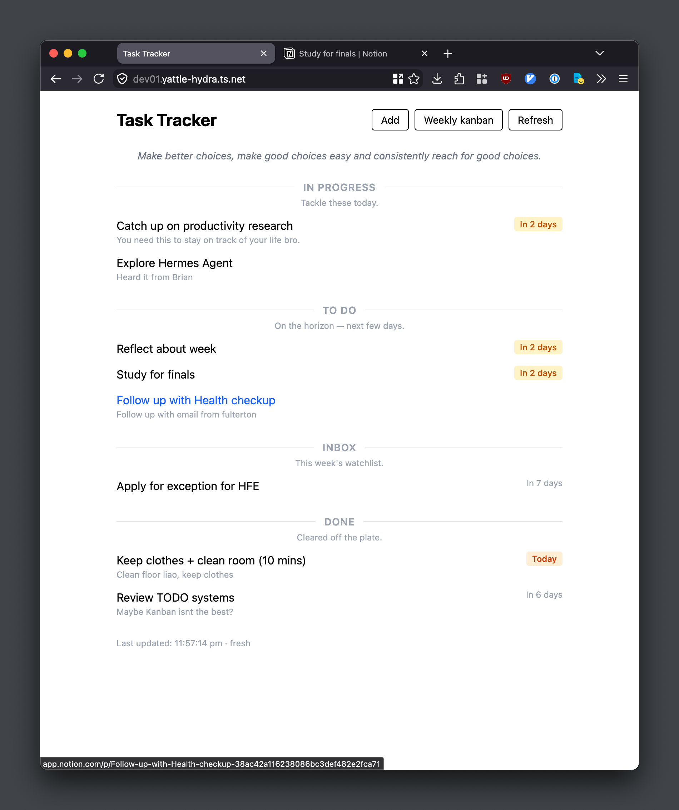
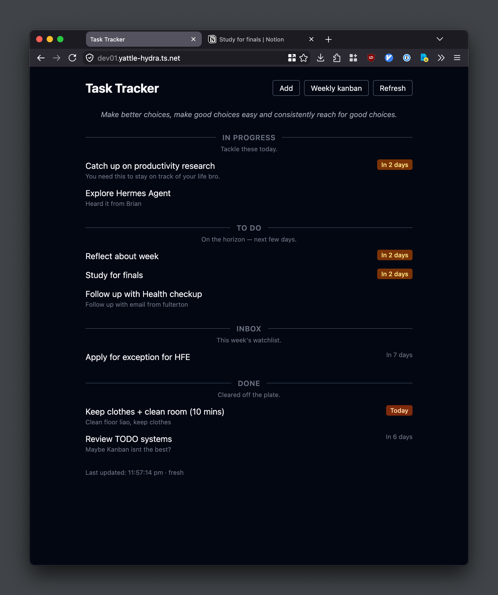

# Task Tracker

A simple, personal fronend for a task tracker powered by a [Notion](https://www.notion.com/) database. Built with Next.js and Tailwind CSS.

Tasks are organized into sections — **In progress**, **To Do**, **Inbox**, and **Done** — with relative due dates and an optional weekly description pulled from the database.



## Features

- Fetches tasks directly from a Notion database
- Relative due dates (Today, Tomorrow, overdue, etc.)
- Dark mode ready (follows system preference)
- Stateless docker container
- Configurable links to Notion kanban and task creation



## Getting Started

```bash
cp .env.example .env   # configure your Notion API key and database ID
npm install
npm run dev
```

Open [http://localhost:3000](http://localhost:3000).

### Docker

```yaml
services:
  app:
    image: ghcr.io/limxingzhi/personal-notion-frontend:latest
    ports:
      - "3000:3000"
    environment:
      - NOTION_TOKEN=${NOTION_TOKEN}
      - NOTION_DATABASE_ID=${NOTION_DATABASE_ID}
    volumes:
      - ./buttons.yaml:/app/buttons.yaml:ro
```

## Configuration

### Notion API

| Variable | Required | Description |
|---|---|---|
| `NOTION_TOKEN` | Yes | Notion internal integration token |
| `NOTION_DATABASE_ID` | Yes | ID of the Notion tasks database |

### Navigation Buttons

Create a `buttons.yaml` file in the project root to define external links rendered in the header:

```yaml
buttons:
  - label: "Weekly kanban"
    url: "https://app.notion.com/..."
  - label: "Add"
    url: "https://example.com/add"
```

## How It Works

1. On load, the app checks a local cache for task data.
2. If the cache is cold or expired, it fetches from the Notion API.
3. Tasks are grouped by their Notion `Status` property and rendered in sorted sections.
4. Manual refresh via the **Refresh** button bypasses the cache.

